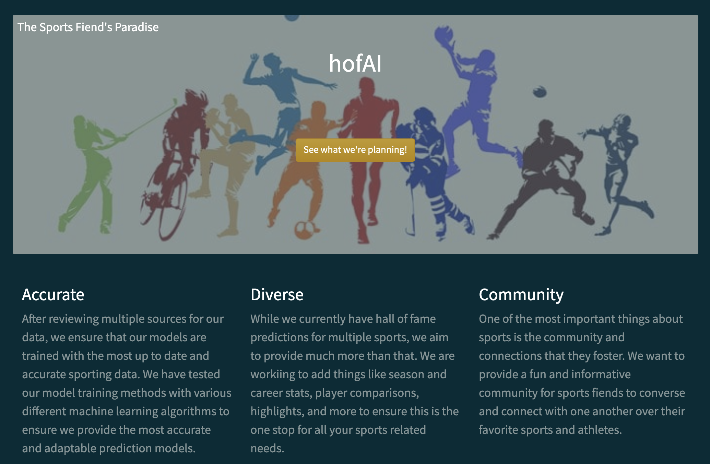
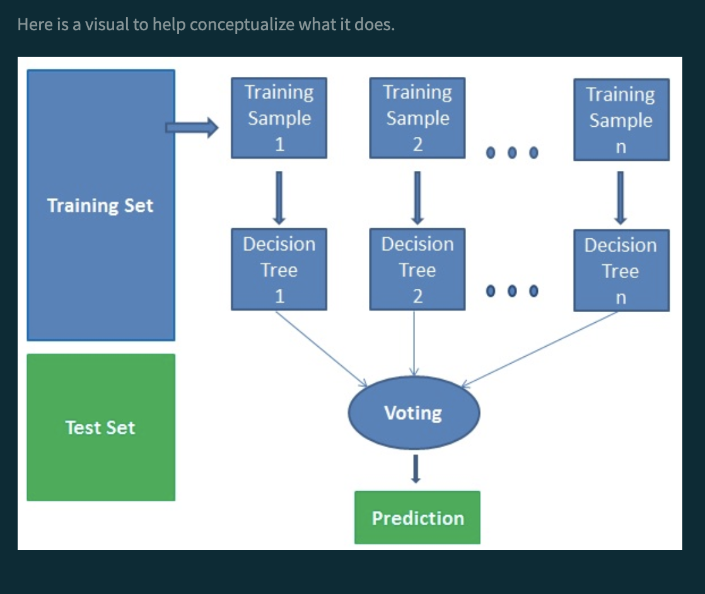

<!--
*** Thanks for checking out the Best-README-Template. If you have a suggestion
*** that would make this better, please fork the repo and create a pull request
*** or simply open an issue with the tag "enhancement".
*** Thanks again! Now go create something AMAZING! :D
***
***
***
*** To avoid retyping too much info. Do a search and replace for the following:
-->

<!-- PROJECT SHIELDS -->
<!--
*** I'm using markdown "reference style" links for readability.
*** Reference links are enclosed in brackets [ ] instead of parentheses ( ).
*** See the bottom of this document for the declaration of the reference variables
*** for contributors-url, forks-url, etc. This is an optional, concise syntax you may use.
*** https://www.markdownguide.org/basic-syntax/#reference-style-links
-->

[![Contributors][contributors-shield]][contributors-url]
[![Forks][forks-shield]][forks-url]
[![Stargazers][stars-shield]][stars-url]
[![Issues][issues-shield]][issues-url]
[![MIT License][license-shield]][license-url]
[![LinkedIn][linkedin-shield]][linkedin-url]

<!-- PROJECT LOGO -->
 

  

  <h3 align="center">Hall of Fame AI</h3>

  

    Database of major league sports players' statistics with hall of fame predictive analysis driven by machine-learning algorithms
     
    <a href="https://github.com/hleejr/hofAI"><strong>Explore the docs »</strong></a>
     
     
    <a href="https://github.com/hleejr/hofAI">View Demo</a>
    ·
    <a href="https://github.com/hleejr/hofAI/issues">Report Bug</a>
    ·
    <a href="https://github.com/hleejr/hofAI/issues">Request Feature</a>
  

<!-- TABLE OF CONTENTS -->

  
<h2 style="display: inline-block">Table of Contents</h2>

  <ol>
    <li>
      <a href="#about-the-project">About The Project</a>
      <ul>
        <li><a href="#built-with">Built With</a></li>
      </ul>
    </li>
    <li><a href="#usage">Usage</a></li>
    <li><a href="#roadmap">Roadmap</a></li>
    <li><a href="#contributing">Contributing</a></li>
    <li><a href="#license">License</a></li>
    <li><a href="#contact">Contact</a></li>
    <li><a href="#acknowledgements">Acknowledgements</a></li>
  </ol>

<!-- ABOUT THE PROJECT -->
## About The Project

I have been obsessed with sports for about as long as I remember. Wanting to get into the sports data industry, creating this project was a fun way for me to combine my newfound data science skills with my lifelong love of sports.

### Built With

* Python
* Pandas
* Django
* AWS Beanstalk

<!-- USAGE EXAMPLES -->
## Usage

Visit [hofAI](https://hofai.herokuapp.com) to view the website.

    

The hall of fame predictions are currently driven by a supervised machine learning algorithm called the Random Tree Classifier

    

You can read more about the models used [here](https://hofai.herokuapp.com/models)!

<!-- ROADMAP -->
## Roadmap

See the [open issues](https://github.com/hleejr/hofAI/issues) for a list of proposed features (and known issues).

<!-- CONTRIBUTING -->
## Contributing

Contributions are what make the open source community such an amazing place to be learn, inspire, and create. Any contributions you make are **greatly appreciated**.

1. Fork the Project
2. Create your Feature Branch (`git checkout -b feature/AmazingFeature`)
3. Commit your Changes (`git commit -m 'Add some AmazingFeature'`)
4. Push to the Branch (`git push origin feature/AmazingFeature`)
5. Open a Pull Request

<!-- Current Objectives -->
## Current Objectives

* Implement mobile styling
* Add player data for sports other than football and basketball
* Test various models and algorithms to see if there is a way to improve model prediction accuracy

<!-- ACKNOWLEDGEMENTS -->
## Acknowledgements

* 
* 
* 

<!-- MARKDOWN LINKS & IMAGES -->
<!-- https://www.markdownguide.org/basic-syntax/#reference-style-links -->
[contributors-shield]: https://img.shields.io/github/contributors/hleejr/hofAI.svg?style=for-the-badge
[contributors-url]: https://github.com/hleejr/hofAI/graphs/contributors
[forks-shield]: https://img.shields.io/github/forks/hleejr/hofAI.svg?style=for-the-badge
[forks-url]: https://github.com/hleejr/hofAI/network/members
[stars-shield]: https://img.shields.io/github/stars/hleejr/hofAI.svg?style=for-the-badge
[stars-url]: https://github.com/hleejr/hofAI/stargazers
[issues-shield]: https://img.shields.io/github/issues/hleejr/hofAI.svg?style=for-the-badge
[issues-url]: https://github.com/hleejr/hofAI/issues
[license-shield]: https://img.shields.io/github/license/hleejr/hofAI.svg?style=for-the-badge
[license-url]: https://github.com/hleejr/hofAI/blob/master/LICENSE.txt
[linkedin-shield]: https://img.shields.io/badge/-LinkedIn-black.svg?style=for-the-badge&logo=linkedin&colorB=555
[linkedin-url]: https://www.linkedin.com/in/henry-bowe-jr-31498916a/
